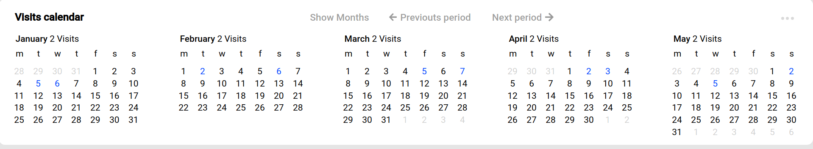

### Адаптивный календарь на React Hooks + luxon + Unstated-next

### Функции
   - Календарь адаптивен, его можно подстроить в любой участок сайта и он сам автоматически подберет оптимальный параметр колчисества календариков внутри себя 
   - Календарь может принимать в себя мероприятия и отображать их дату и описание 
   - Календарь использует не тип Date, а luxon

## Внешний вид 




# Компиляция

```
yarn start
```
